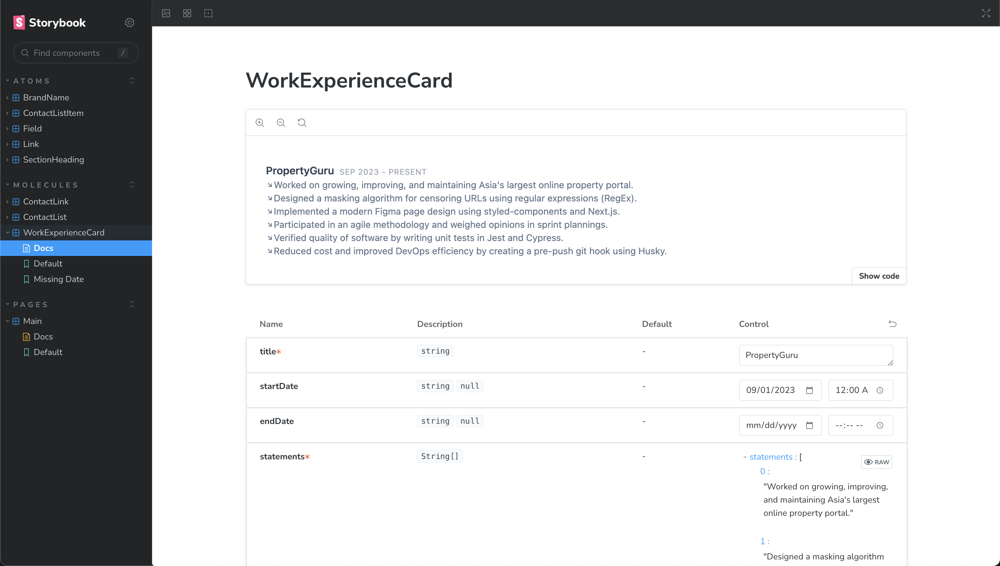
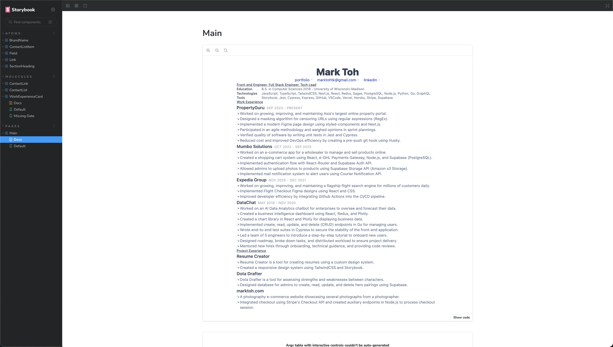

# Resume Creator

A tool for creating a resume.

## Table of Contents

- 🚀 [Getting Started](#getting-started)
- 👨‍💻 [Development](#development)

## Getting Started

Checkout [Storybook](#storybook) to view the design system.

Checkout [Next.js](#nextjs) to run the app.

## Development

### Storybook

A tool for managing the design system. It can be used to create, verify, and showcase all visual elements within the application.

#### `npm run storybook`

> Starts [Storybook](https://storybook.js.org/).

| Component |                                Preview                                |
| --------- | :-------------------------------------------------------------------: |
| Molecule  |  |
| Page      |      |

### Next.js

The web development server. It runs the app that will be used in production.

#### `npm run dev`

> Starts the [Next.js](https://nextjs.org/) server

Click `Print` on your browser to save a copy of the resume.
